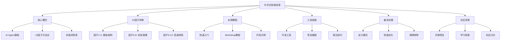
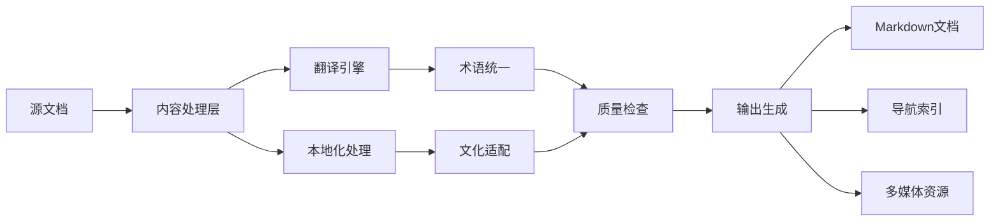
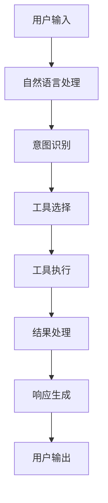

# 12-Factor Agents 中文文档设计文档

## 概述

本设计文档描述了为12-factor-agents项目创建全面中文文档的技术架构和实现方案。该文档系统将基于现有英文内容进行翻译、扩展和本地化，为中文开发者提供从入门到精通的完整学习路径。

## 总体架构

### 文档结构设计



### 技术架构



## 核心模块设计

### 1. 内容翻译模块

#### 翻译策略
- **直译与意译结合**：技术术语保持准确性，概念解释注重可理解性
- **术语标准化**：建立统一的中英文术语对照表
- **上下文适配**：根据中文开发者背景调整示例和说明

#### 术语管理系统
```typescript
interface TerminologyEntry {
  english: string;
  chinese: string;
  category: 'technical' | 'concept' | 'tool';
  context?: string;
  alternatives?: string[];
}

const terminologyMap: TerminologyEntry[] = [
  {
    english: "Agent",
    chinese: "智能体",
    category: "technical",
    context: "AI系统中的自主决策单元"
  },
  {
    english: "Tool Calling",
    chinese: "工具调用",
    category: "technical",
    context: "LLM调用外部函数的机制"
  },
  // ... 更多术语定义
];
```

### 2. 文档结构模块

#### 层次化组织
```
docs-zh/
├── README.md                    # 中文主页
├── getting-started/             # 快速入门
│   ├── introduction.md          # 项目介绍
│   ├── installation.md          # 安装指南
│   └── first-agent.md           # 第一个Agent
├── concepts/                    # 核心概念
│   ├── overview.md              # 概述
│   ├── agent-architecture.md    # Agent架构
│   └── terminology.md           # 术语表
├── factors/                     # 12因子详解
│   ├── factor-01-natural-language-to-tool-calls.md
│   ├── factor-02-own-your-prompts.md
│   └── ... (其他因子)
├── tutorials/                   # 实践教程
│   ├── workshop/                # Workshop教程
│   ├── examples/                # 代码示例
│   └── advanced/                # 高级教程
├── tools/                       # 工具指南
│   ├── create-12-factor-agent.md
│   ├── walkthroughgen.md
│   └── debugging.md
├── best-practices/              # 最佳实践
│   ├── design-patterns.md
│   ├── performance.md
│   └── troubleshooting.md
├── community/                   # 社区资源
│   ├── projects.md
│   ├── resources.md
│   └── contributing.md
└── assets/                      # 多媒体资源
    ├── images/
    ├── diagrams/
    └── videos/
```

### 3. 内容增强模块

#### 代码示例本地化
```typescript
// 原英文示例
const agent = new Agent({
  role: "helpful assistant",
  tools: [calculator, emailSender]
});

// 中文注释版本
const agent = new Agent({
  role: "helpful assistant", // 角色：有用的助手
  tools: [calculator, emailSender] // 工具：计算器和邮件发送器
});

// 完整中文示例
const 智能助手 = new Agent({
  角色: "有用的助手",
  工具列表: [计算器工具, 邮件发送工具],
  提示词: `
    你是一个专业的AI助手，能够：
    1. 进行数学计算
    2. 发送邮件通知
    3. 与用户进行自然语言交互
  `
});
```

#### 图表本地化


### 4. 导航和搜索模块

#### 智能导航系统
```typescript
interface NavigationItem {
  title: string;
  path: string;
  level: number;
  category: string;
  tags: string[];
  difficulty: 'beginner' | 'intermediate' | 'advanced';
}

const navigationStructure: NavigationItem[] = [
  {
    title: "快速入门",
    path: "/getting-started",
    level: 1,
    category: "入门",
    tags: ["基础", "安装"],
    difficulty: "beginner"
  },
  // ... 更多导航项
];
```

#### 搜索功能设计
- **全文搜索**：支持中文分词和语义搜索
- **标签过滤**：按难度、类别、主题筛选
- **智能推荐**：基于用户阅读历史推荐相关内容

### 5. 多媒体资源模块

#### 图像资源管理
```typescript
interface ImageResource {
  id: string;
  originalPath: string;
  localizedPath: string;
  altText: string;
  caption?: string;
  annotations?: Annotation[];
}

interface Annotation {
  x: number;
  y: number;
  width: number;
  height: number;
  text: string;
  type: 'label' | 'explanation' | 'highlight';
}
```

#### 视频内容策略
- **字幕本地化**：为现有英文视频添加中文字幕
- **录制中文版本**：关键概念的中文讲解视频
- **交互式演示**：可操作的代码演示和流程图

## 实现计划

### 阶段1：基础架构搭建
1. **文档结构创建**：建立完整的目录结构
2. **术语表建立**：创建标准化的中英文术语对照
3. **模板设计**：设计统一的文档模板和样式

### 阶段2：核心内容翻译
1. **主要文档翻译**：README、12因子文档、核心概念
2. **代码示例本地化**：添加中文注释和说明
3. **图表重制**：创建中文版本的架构图和流程图

### 阶段3：教程和实践内容
1. **Workshop翻译**：完整的实践教程中文版
2. **示例项目**：创建中文版的示例项目
3. **最佳实践指南**：结合中文开发者特点的实践建议

### 阶段4：增强功能
1. **搜索和导航**：实现智能搜索和导航功能
2. **多媒体内容**：添加视频、动画等多媒体资源
3. **社区集成**：建立中文社区资源和讨论渠道

### 阶段5：质量保证和优化
1. **内容审核**：专业审核和用户反馈收集
2. **性能优化**：文档加载和搜索性能优化
3. **持续更新**：建立与英文版本同步更新的机制

## 技术实现细节

### 文档生成工具链
```typescript
interface DocumentProcessor {
  source: string;
  target: string;
  processors: ContentProcessor[];
}

interface ContentProcessor {
  name: string;
  process(content: string): Promise<string>;
}

class ChineseDocumentationBuilder {
  private processors: ContentProcessor[] = [
    new TerminologyProcessor(),
    new CodeCommentProcessor(),
    new ImageLocalizationProcessor(),
    new NavigationProcessor()
  ];

  async build(sourceDir: string, targetDir: string): Promise<void> {
    // 实现文档构建逻辑
  }
}
```

### 质量保证机制
```typescript
interface QualityCheck {
  name: string;
  check(content: string): QualityResult;
}

interface QualityResult {
  passed: boolean;
  issues: QualityIssue[];
  suggestions: string[];
}

const qualityChecks: QualityCheck[] = [
  new TerminologyConsistencyCheck(),
  new TranslationQualityCheck(),
  new CodeValidationCheck(),
  new LinkValidationCheck()
];
```

## 维护和更新策略

### 版本同步机制
- **自动检测**：监控英文版本更新
- **差异分析**：识别需要更新的内容
- **增量翻译**：只翻译变更的部分
- **质量验证**：确保更新后的一致性

### 社区贡献流程
- **贡献指南**：明确的贡献规范和流程
- **审核机制**：多层次的内容审核
- **反馈收集**：用户反馈和改进建议
- **激励机制**：贡献者认可和奖励

## 成功指标

### 内容质量指标
- **翻译准确率**：≥95%
- **术语一致性**：100%
- **代码示例可执行率**：100%
- **链接有效性**：≥98%

### 用户体验指标
- **文档完整性**：覆盖所有英文内容
- **搜索准确率**：≥90%
- **页面加载时间**：≤3秒
- **移动端适配**：完全支持

### 社区参与指标
- **用户反馈响应时间**：≤24小时
- **内容更新频率**：与英文版本同步
- **社区贡献数量**：持续增长
- **用户满意度**：≥4.5/5.0