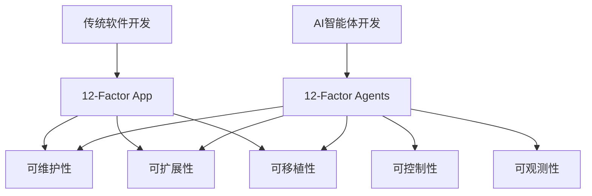
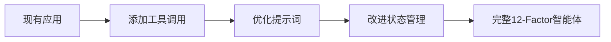

# 项目介绍

欢迎来到 **12-Factor Agents** 的世界！本指南将帮助您了解这个项目的核心理念、设计原则和实际价值。

## 什么是 12-Factor Agents？

12-Factor Agents 是一个教育框架和工具集合，专门为构建**生产就绪的AI智能体应用**而设计。它借鉴了著名的 [12-Factor App 方法论](https://12factor.net/)，将其核心原则应用到AI智能体开发领域。

### 核心理念



## 为什么需要 12-Factor Agents？

### 当前AI智能体开发的挑战

1. **原型到生产的鸿沟**
   - 大多数AI框架优化了快速原型开发
   - 但在生产环境中缺乏可靠性和可维护性

2. **框架锁定问题**
   - 过度依赖特定框架的抽象
   - 难以根据具体需求进行定制

3. **缺乏最佳实践指导**
   - AI智能体开发相对较新
   - 缺乏成熟的架构模式和设计原则

### 12-Factor Agents 的解决方案

```typescript
// 传统框架方式 - 黑盒抽象
const agent = new Framework({
  role: "assistant",
  tools: [tool1, tool2],
  // 难以控制内部逻辑
});

// 12-Factor 方式 - 开发者控制
export async function agentLoop(thread: Thread): Promise<Thread> {
  while (true) {
    const nextStep = await determineNextStep(thread);
    
    switch (nextStep.intent) {
      case "done":
        return thread;
      case "calculate":
        thread = await handleCalculation(nextStep, thread);
        break;
      // 完全控制每个决策点
    }
  }
}
```

## 核心设计原则

### 1. 开发者控制优先

**不是**：依赖框架的黑盒抽象
**而是**：拥有完整的控制权

```rust
// 您的提示词，您的控制
function DetermineNextStep(thread: string) -> ToolCall | DoneForNow {
  prompt #"
    您是一个有用的助手...
    
    当前对话状态：
    {{ thread }}
    
    下一步应该做什么？
    {{ ctx.output_format }}
  "#
}
```

### 2. 渐进式采用

不需要完全重写现有系统，可以逐步采用12-Factor原则：



### 3. 生产就绪

从第一天开始就考虑生产环境的需求：

- **可观测性**：完整的执行日志和状态跟踪
- **错误处理**：优雅的降级和恢复机制
- **人机交互**：内置的审批和反馈流程
- **可扩展性**：支持分布式和无服务器部署

## 12个因子概览

### 基础架构因子 (1-4)
1. **自然语言到工具调用** - 结构化的LLM输出
2. **掌控你的提示词** - 提示词即代码
3. **掌控你的上下文窗口** - 自定义序列化
4. **工具即结构化输出** - 类型安全的工具调用

### 状态管理因子 (5-8)
5. **统一执行状态** - 单一状态容器
6. **启动/暂停/恢复** - 异步工作流支持
7. **通过工具联系人类** - 人机交互模式
8. **掌控控制流** - 明确的执行逻辑

### 高级特性因子 (9-12)
9. **压缩错误** - 高效错误处理
10. **小型专注智能体** - 微智能体架构
11. **多渠道触发** - 灵活的接入方式
12. **无状态归约器** - 函数式设计

## 实际应用场景

### 客服智能体
```typescript
// 处理客户查询，需要人工审批敏感操作
const customerServiceAgent = {
  tools: ['查询订单', '处理退款', '升级问题'],
  humanApproval: ['退款操作', '账户修改'],
  channels: ['网站聊天', '邮件', '电话']
};
```

### 部署智能体
```typescript
// 自动化部署流程，关键步骤需要确认
const deploymentAgent = {
  tools: ['检查代码', '运行测试', '部署到生产'],
  humanApproval: ['生产部署'],
  rollback: '自动回滚机制'
};
```

### 数据分析智能体
```typescript
// 分析数据并生成报告
const analyticsAgent = {
  tools: ['查询数据库', '生成图表', '发送报告'],
  schedule: '定时执行',
  notifications: ['邮件', 'Slack']
};
```

## 与其他方法的对比

| 特性 | 传统框架 | 12-Factor Agents |
|------|------------------|
| 学习曲线 | 低 | 中等 |
| 控制程度 | 低 | 高 |
| 生产就绪 | 需要额外工作 | 内置支持 |
| 可定制性 | 受限 | 完全可定制 |
| 调试能力 | 困难 | 透明可观测 |
| 扩展性 | 框架依赖 | 架构原生支持 |

## 开始您的旅程

### 适合人群

- **AI工程师**：寻求构建生产级智能体应用
- **软件开发者**：希望在现有产品中集成AI能力
- **技术创始人**：需要将AI原型转化为产品
- **架构师**：设计可扩展的AI系统

### 学习路径

1. **快速体验** (30分钟)
   - 安装 `create-12-factor-agent`
   - 创建第一个智能体
   - 运行基础示例

2. **深入理解** (2-3小时)
   - 阅读12个因子文档
   - 完成Workshop教程
   - 理解设计原理

3. **实践应用** (1-2天)
   - 构建自己的智能体
   - 集成到现有系统
   - 部署到生产环境

### 下一步

准备好开始了吗？让我们从[环境配置](installation.md)开始，搭建您的开发环境！

或者，如果您想先了解更多理论背景，可以查看[核心概念](../concepts/overview.md)。

---

*记住：12-Factor Agents 不是另一个框架，而是一套经过实战验证的原则和模式，帮助您构建真正可靠的AI智能体应用。*